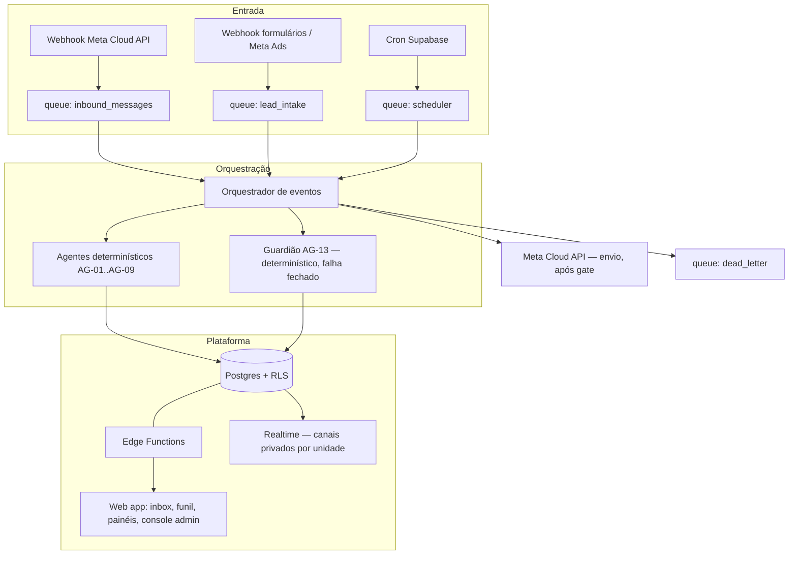

# Escopo Definitivo — Central de Atendimento e Conversão Comercial · Academia das Específicas

| Item | Informação |
|---|---|
| **Versão** | 1.0 (minuta para validação da consultora e do cliente) · 21/09/2026 |
| **Empresa** | Academia das Específicas Gestão Educacional Ltda. (cursinho pré-vestibular — ENEM, UnB, PAS/UnB, particulares de medicina do DF; unidades Asa Sul e Taguatinga; produtos modulares: 7 específicas, Orientação de Estudos, Cabine VIP, Monitoria) |
| **Frontend** | Aplicação web responsiva (desktop-first para operação de atendimento, utilizável em mobile) |
| **Backend/banco** | **Supabase** (Postgres versionado por migrations, Auth, RLS, Edge Functions, Realtime, Storage, Vault/Secrets, Cron) — decisão da consultora técnica (Kim), 21/09/2026 |
| **Sistema legado** | Kommo CRM (`academiaespecificas.kommo.com`) — fonte de migração e operação paralela até decommission na Fase 5 |
| **Canal** | WhatsApp via **Meta Cloud API (oficial)** — produtivo somente após GATE-03; até lá a operação real continua no Kommo |
| **Horizonte** | 5 fases (ver §18); prazo operacional crítico: Fases 1–3 concluídas antes da **Black Friday (nov/2026)** — fora dessa janela, o primeiro ciclo sazonal mensurável só ocorre em jan–fev/2027 |

> **Correção de grounding (importante):** o escopo base (01-Escopo.md, 29/08) descartou o `ADES- Map de Processos.pdf` como "operação logística de terceiros". **Isso é um erro: o PDF é o briefing oficial deste projeto** — define o gargalo ("perda de leads qualificados por baixa velocidade, organização e consistência no atendimento e follow-up"), os 3 critérios de sucesso (§1) e as 3 tarefas de mapeamento. Este escopo definitivo o trata como fonte soberana de critérios, junto com o Manual de Boas Práticas, o Mapeamento de Processos MKT, o vídeo do Kommo (28/08), o DMO (29/08) e as reuniões (Sales Call 16/07, tl;dv `6a590ba47096f40014fb4cf9`; Kick-off 05/08, tl;dv `6a73882f59a0ab00138e99f6`).

---

## 1. Resultado de negócio

**Outcome:** estruturar e automatizar o processo de atendimento e follow-up comercial, garantindo que **todo lead recebido seja rapidamente atendido, qualificado e acompanhado até matrícula ou perda registrada** (briefing ADES). A Academia já gera demanda (60–65% das matrículas vêm de indicação/ex-alunos + tráfego pago); o problema é converter a demanda existente — a conversão presencial com sócios é próxima de 100%, a perda acontece antes disso.

**Perdas que o sistema ataca (numeradas):**
- **P1 — Leads sem resposta rápida:** tempo médio de primeira resposta em Taguatinga ~21 min (ideal interno ≤10 min; conversão cai fortemente após ~30 min — Manual, p.14).
- **P2 — Leads qualificados sem próxima ação:** leads "somem" dentro do processo; cartões sem tarefa, responsável ou prazo; conferência visual diária de colunas.
- **P3 — Cadência de FUP manual:** arraste manual FUP 1→2→3, prazos controlados de memória, contatos esquecidos.
- **P4 — Retrabalho de dados:** correção manual de telefone (DDD/nono dígito), mesclagem manual de duplicatas, etapas desatualizadas, valor de venda não registrado.
- **P5 — Custo e ruído de mensagens:** templates pagos disparados sem necessidade (janela 24h ignorada, reunião agendada não consultada).
- **P6 — Invisibilidade do funil:** sem indicadores ponta a ponta (origem→matrícula) para decisão rápida em janela de venda curta (jan–fev, Black Friday, jul–ago).

**Resultados mensuráveis de COBERTURA (metas de processo — válidas desde a Fase 2, independentes de baseline):**
- 100% dos leads recebidos geram registro idempotente com origem, unidade e carimbo de tempo.
- 100% das transições de etapa geram trilha de auditoria (quem, quando, de→para, motivo quando obrigatório).
- 100% dos leads em etapa comercial ativa possuem próxima ação + responsável + prazo; violações aparecem como pendência de gestão.
- 100% das desqualificações com motivo registrado; 100% das matrículas concluídas com checklist completo.

**Critérios de sucesso do briefing (metas de resultado — mensuráveis após baseline congelado, GATE-02):**

| ID | Critério (briefing ADES) | Definição operacional | Anti-gameação |
|---|---|---|---|
| **K1** | ≥95% dos leads atendidos dentro do SLA | leads com primeira resposta humana ≤ SLA (número a definir, GATE-01; referência interna: 10 min) ÷ leads recebidos no período | "Atendido" = mensagem humana enviada ao lead, não boas-vindas automática do bot; leads com telefone inválido saem do denominador somente com registro de exceção "Enviar e-mail" |
| **K2** | ≥95% dos leads qualificados com próxima ação registrada | leads em etapa ativa com próxima ação + responsável + prazo ÷ leads qualificados no período | "Qualificado" exige os campos obrigatórios da RN-04; lead estacionado em "Interesse 2027" não conta no denominador (tem política própria) |
| **K3** | +30% de conversão lead qualificado → matrícula | matrículas originadas de leads ÷ leads qualificados, comparado ao baseline congelado × 1,30 | Marco de conversão = checklist de matrícula concluído (GATE-12); matrícula presencial espontânea sem lead entra como lead retroativo com origem "presencial" — nunca excluída do denominador |

**Baseline-first:** K1 e K2 são instrumentáveis desde a Fase 2; K3 exige baseline de conversão medido por 30 dias de operação real (GATE-02). Nenhuma meta de resultado é cobrada do sistema antes do baseline existir.

---

## 2. Decisões estruturais confirmadas (DEC)

| ID | Decisão | Consequência |
|---|---|---|
| DEC-01 | **Supabase como plataforma única** (Postgres, Auth, RLS, Edge Functions, Realtime, Storage, Cron, Vault) | Sem servidor separado; toda lógica server-side vive em Edge Functions + policies; migrations versionadas, nunca DDL manual em produção |
| DEC-02 | **Sistema próprio** (Central de Atendimento e Conversão), não expansão do Kommo | Kommo permanece operando em paralelo até a Fase 5; nada de novo é construído no Kommo; migração por export (DEC-09) |
| DEC-03 | **WhatsApp oficial (Meta Cloud API)** como canal único produtivo | Sem canal não oficial; custos de template pagos são orçados e visíveis; número e conta de business sob GATE-03 |
| DEC-04 | **O sistema funciona integralmente sem IA**; IA generativa é camada assistida opcional da Fase 4, sempre com revisão humana obrigatória | Nenhum agente de IA envia mensagem, move etapa, promete condição ou recomenda curso autonomamente |
| DEC-05 | **Atendimento humano consultivo preservado** (Manual de Boas Práticas) | Automação controla o processo (filas, prazos, tarefas, validações); pessoas conduzem a conversa, recomendam turmas e decidem |
| DEC-06 | **Multi-unidade desde a Fase 1** (Asa Sul, Taguatinga) | Segregação de carteira por RLS no banco (regra atual observada, vídeo 03:05), não apenas escondida na interface |
| DEC-07 | **Funil configurável pelo admin**: etapas, SLA, prazos de FUP, motivos de desqualificação, templates e campos obrigatórios editáveis sem código | O funil inicial espelha o Kommo atual (15 etapas, §8); mudanças de processo não dependem de deploy |
| DEC-08 | **Cadência de FUP determinística, envio humano**: FUP 1 ≤20h, FUP 2 ≤24h, FUP 3 retomada posterior com template aprovado (regra atual, Mapeamento MKT 8.2) | O sistema cria a tarefa, move a situação e informa o tipo de mensagem permitido; o atendente personaliza e envia |
| DEC-09 | **Migração do Kommo por export**, com fixture sintética na Fase 1 e dados reais somente após GATE-04 | Nenhum dado real de aluno/responsável entra antes da política de LGPD (GATE-09) |
| DEC-10 | **Segredo só no servidor**: tokens Meta e chaves nunca no frontend; referência por `secret_ref`, nunca reexibidos | Logs sanitizados sem payload de mensagem; auditoria sem conteúdo sensível |
| DEC-11 | **Configuração por interface** (console administrativo, §6.8) | SLA, prazos, réguas, motivos, templates, campos obrigatórios e distribuição são dados, não código |
| DEC-12 | **Baseline-first para metas de resultado** | K3 só é cobrado após 30 dias de operação real congelada (GATE-02); metas de cobertura (§1) valem desde a Fase 2 |

---

## 3. Fontes de verdade por domínio

| Domínio | Fonte de verdade | Cópia local permitida (Supabase) |
|---|---|---|
| Lead, conversa comercial, qualificação, orçamento, negociação, matrícula comercial | **Supabase (novo dono)** a partir da Fase 2 | — |
| Entrega de mensagem WhatsApp, janela 24h, status de template | **Meta Cloud API** | Espelho de status por mensagem (idempotente), sem reprocessar |
| Dados legados do funil (até a data de corte) | **Kommo** (somente leitura via export) | Snapshot importado uma vez, marcado `migrated=true`, imutável |
| Agenda de reuniões do diretor | A definir (GATE-06: ferramenta atual desconhecida) | Espelho de reunião vinculada ao lead (id + data/hora + resultado) |
| Captação (formulários Meta Ads/landing pages) | Meta Ads / formulários | Dados recebidos por webhook com origem/campanha; qualidade de dados é GATE-11 |
| Matrícula contratual/financeira (contrato, pagamento) | Fora do sistema (processo administrativo existente) | Somente registro comercial: valor final confirmado + checklist concluído |
| Produtos, turmas e grade (o que está com matrícula aberta) | Cadastro administrativo no Supabase (mantido pela Academia) | — |

---

## 4. Atores, papéis e permissões

Papéis técnicos (aplicados por RLS no banco, não apenas na interface):

| Papel | Quem | Permissões-chave |
|---|---|---|
| `platform_admin` | Administração da plataforma (direção) | Tudo: unidades, usuários, configuração de funil/réguas, auditoria, export |
| `unit_manager` | Gestor de unidade (Asa Sul / Taguatinga) | Leitura/escrita de leads da própria unidade; reatribuição; painel da unidade; auditoria de amostras de conversa |
| `attendant` | Atendente/vendedor | Leads da própria unidade (regra atual, vídeo 03:05); conversas, qualificação, orçamento, FUP, matrícula, desqualificação com motivo |
| `negotiator` | Orientadores/financeiro (negociação de condição) | Fila de negociação (todas as unidades); decisão de alçada registrada; retorno ao atendente |
| `director` | Diretor/coordenador responsável por reuniões | Leads com reunião agendada/pendente de resultado; registro do resultado da reunião |
| `marketing` | Marketing | Somente leitura de painéis e indicadores (origem, campanha, conversão); sem acesso a conversas |
| `viewer` | Diretoria | Leitura consolidada |
| `service_role` | Runtime de Edge Functions/agentes | Acesso programático; toda ação nasce de evento versionado e é auditada |
| `agent` (identidade técnica) | Agentes automáticos (§9) | Sem papel de usuário; ações registradas como sistema com `execution_id` |

Regras: um usuário pode acumular papéis; `attendant` nunca vê leads de outra unidade (RLS); `marketing` nunca lê conteúdo de conversa (LGPD, §15).

---

## 5. Arquitetura de referência

**Princípios arquiteturais:**
1. Webhook responde rápido (ack ≤2s) e delega o trabalho à fila — nunca processa na requisição.
2. Cron **enfileira**, não executa: todo disparo de cadência nasce de um evento versionado na fila.
3. Realtime somente em canais privados por unidade/usuário (RLS); nenhuma atualização de conversa via canal público.
4. Toda ação automática nasce de evento versionado com `event_id` idempotente; reprocessamento nunca duplica efeito.
5. O guardião (AG-13) valida toda ação de escrita automática; na dúvida, **falha fechado**: não executa e abre exceção humana.
6. Nenhuma escrita no Kommo (legado é somente leitura); nenhuma leitura de produção antes dos gates.

---

## 6. Componentes da plataforma

**6.1 Postgres** — migrations versionadas (timestamp ordinal); zero DDL manual em produção; toda tabela com `created_at/updated_at` e, onde fizer sentido, `unit_id` para RLS.

**6.2 Auth** — e-mail/senha com MFA obrigatório para `platform_admin`; convite por e-mail; desativação imediata de usuário (sem delete, LGPD §15); sessão com expiração configurável.

**6.3 RLS** — policies explícitas por papel e unidade; `attendant` filtra `unit_id`; `marketing` bloqueado em tabelas de mensagem; testes de policy fazem parte do TDD de cada SPEC.

**6.4 Edge Functions** — catálogo no §11; cada função com papel mínimo exigido; webhooks públicos com verificação de assinatura (HMAC do Meta) e rate limit.

**6.5 Realtime** — inbox e funil ao vivo por unidade; presença de atendente; nada de payload sensível em canal público.

**6.6 Filas duráveis (tabela `queue_jobs`)** — consumidor nomeado, `visible_at`, tentativas, backoff com jitter, dead-letter:

| Fila | Consumidor | Finalidade |
|---|---|---|
| `lead_intake` | AG-01/AG-02/AG-03 | Validação, deduplicação, distribuição de novo lead |
| `inbound_messages` | AG-05 + orquestrador | Processamento de mensagem recebida, janela 24h |
| `outbound_messages` | AG-05 + Meta sender | Envio (após GATE-03), controle de template |
| `cadence_scheduler` | AG-04 | Cadência FUP 1/2/3, alertas de SLA |
| `meeting_watch` | AG-06 | Bloqueio/liberação por reunião |
| `reactivation_2027` | AG-07 | Retomada de interesse futuro (novembro) |
| `enrollment_check` | AG-08 | Conferência de checklist de matrícula |
| `metrics_rollup` | AG-09 | Consolidação de indicadores |
| `dead_letter` | Revisão humana | Falhas exaustas, com contexto |

**6.7 Cron** — varreduras por minuto (SLA/cadência), hora em hora (rollup), diária (janela 24h expirada, retomadas); cada disparo só enfileira.

**6.8 Console administrativo (módulos configuráveis, sem código):**
1. Unidades e usuários (papéis, convite, desativação)
2. Funil e etapas (nome, ordem, cor, etapa terminal, campos obrigatórios por etapa)
3. SLA e réguas (primeira resposta, FUP 1/2/3, contagem: horas corridas × úteis — GATE-07)
4. Motivos de desqualificação (catálogo, GATE-08)
5. Templates de mensagem (texto, classificação Marketing/Utilidade, atalho, status de aprovação Meta)
6. Distribuição de leads (regra por unidade/round-robin/capacidade)
7. Produtos e turmas com matrícula aberta (catálogo por período)
8. Campos de qualificação (objetivo, ano escolar, turno, etapa PAS, dificuldade)
9. Checklist de matrícula (itens obrigatórios, GATE-12)
10. Alçadas de negociação (quem aprova o quê — GATE-05)
11. LGPD (retenção, anonimização, export do titular)
12. Observabilidade (filas, dead-letter, alertas, health)

**6.9 Operação do canal (Meta Cloud API, oficial — tabela de riscos):**

| Aspecto | Regra |
|---|---|
| Janela de 24h | Após mensagem do cliente, mensagens livres por 24h; cronômetro visível no cartão (regra atual, vídeo 01:43) |
| Fora da janela | Somente template aprovado (Marketing/Utilidade), com custo por disparo — todo envio de template exige confirmação humana e é contabilizado |
| Boas-vindas | Template de boas-vindas automático no primeiro contato (equivalente ao SalesBot atual, vídeo 09:13) — não conta como "atendimento" para K1 |
| Número | Conta de business + número a definir (GATE-03); sem troca automática de número; sem operação produtiva antes de homologar |
| Falha de envio | Retry com backoff; falha exausta → dead-letter + exceção; nunca silencioso |
| Custo | Painel de disparos pagos por período/unidade (ataque à P5) |

---

## 7. Modelo de dados (tabelas por domínio, campos principais)

**Grupo A — Organização e acesso:** `units` (unidades), `users` (papel, unidade, status), `role_assignments`, `auth_audit`.

**Grupo B — Captação e leads:** `leads` (nome contato, nome aluno, nome responsável financeiro, telefone normalizado E.164, e-mail, `unit_id`, origem, campanha, `stage_id`, `owner_id`, `score`*, `entered_at`, `first_reply_at`, `last_interaction_at`, `migrated`), `lead_origins` (catálogo: Meta Ads, Instagram, indicação, presencial, QR Code, link), `lead_campaigns`, `lead_merge_log` (deduplicação auditável), `lead_exceptions` (telefone inválido → "Enviar e-mail").
*`score`: campo existe no Kommo sem regra conhecida — mantido como dado importado, **não usado em decisão** até GATE-10.

**Grupo C — Conversas e canal:** `conversations` (lead, canal, estado, `window_expires_at`), `messages` (direção, tipo livre/template, `template_id`, `meta_message_id` idempotente, `sent_by` usuário/agente, custo quando template), `templates` (texto, classificação, atalho, status aprovação), `channel_settings` (número, limites).

**Grupo D — Funil e qualificação:** `stages` (nome, ordem, terminal, bloqueia cadência), `stage_transitions` (lead, de→para, quem, quando, motivo quando obrigatório — trilha de auditoria), `qualification_data` (objetivo: ENEM/PAS/UnB/particulares; etapa PAS 1ª/2ª/3ª; ano escolar; experiência anterior; maior dificuldade; turno; interesse/curso/turma), `quotes` (valor, data envio, itens), `next_actions` (lead, ação, responsável, prazo, status — dona do K2), `tasks` (tipo, origem regra, contexto, prazo, status).

**Grupo E — Negociação, reunião, matrícula:** `negotiations` (lead, objeção, responsável, decisão, condição aprovada, alçada, retornada_em), `meetings` (lead, data/hora, tipo presencial/online, status: agendada/realizada/não compareceu, resultado: fechou/segue avaliação/desqualificou), `enrollments` (lead, valor final, cursos/específicas contratadas, checklist pendências), `enrollment_checklist_items` (catálogo configurável), `disqualification_reasons` (catálogo) + `disqualifications` (lead, motivo, quem, quando).

**Grupo F — Campanhas futuras:** `future_interests` (lead, turma-alvo 2027, `reactivate_at` novembro, status), `reactivation_log`.

**Grupo G — Execução, auditoria e observabilidade:** `events` (event_id idempotente, tipo, payload sanitizado), `queue_jobs`, `dead_letter_jobs`, `agent_executions` (agente, entrada, decisão, resultado, tokens quando IA), `audit_log` (append-only: quem/o quê/quando, sem payload de mensagem), `sla_breaches`, `metrics_daily` (rollup por unidade/origem/etapa), `cost_log` (disparos pagos), `lgpd_requests` (titular, tipo, prazo, status).

---

## 8. Estados principais

**Lead/funil (espelha o Kommo atual — configurável, DEC-07):**
`Novo contato` → `Enviar e-mail` (exceção telefone inválido) | `Em atendimento` → `Sem resposta` | `Qualificado` → `Orçamento enviado` → `FUP 1` → `FUP 2` → `FUP 3` → `Negociação` → `Sem resposta pós negociação` → `Em matrícula` → `Novo aluno` (terminal) | `Interesse 2027` (estacionamento com retomada) | `Desqualificado` (terminal, motivo obrigatório).

**Regras de fechamento e exceção:**
- `Novo contato` só sai da etapa quando há **resposta do lead** — receber boas-vindas automática não move (regra atual, Mapeamento MKT).
- `Desqualificado` exige motivo do catálogo (RN-09); transição bloqueada sem motivo.
- `Novo aluno` exige checklist de matrícula completo (RN-12) e valor final confirmado.
- `Interesse 2027` suspende cadência comercial e agenda retomada em novembro (RN-10).
- Reunião agendada **suspende** FUPs e templates (RN-15) até resultado registrado: compareceu/não compareceu/fechou/segue avaliação/desqualificou.
- Conversa: `aberta` / `janela_24h_ativa` / `fora_janela` / `fechada`; Tarefa: `pendente`/`feita`/`cancelada` (cancelamento com motivo); Negociação: `aberta`/`decidida`/`devolvida`/`sem_resposta`; Execução de agente: `recebida`/`processando`/`sucesso`/`falhou`/`bloqueada_pelo_guardião`.

---

## 9. Catálogo de agentes (papéis lógicos sobre UM runtime compartilhado)

| ID | Agente | Meta | Entrada | Autonomia |
|---|---|---|---|---|
| AG-01 | Validador de contato | Validar telefone (E.164) e e-mail na entrada | Novo lead (fila `lead_intake`) | Determinística: válido segue; inválido → exceção "Enviar e-mail". Nunca "adivinha" número (eliminação da correção manual, vídeo 01:00) |
| AG-02 | Deduplicador | Detectar mesmo telefone/e-mail | Criação/atualização de lead | Consolidar somente caso exato preservando histórico/origem (RN-14); conflito → fila de revisão humana |
| AG-03 | Distribuidor | Atribuir lead à unidade/responsável | Lead válido | Regra configurável (origem/capacidade/round-robin); cria fila priorizada por tempo aguardando |
| AG-04 | Cadência de FUP | Criar tarefa e mover situação sem resposta | Prazo transcorrido (cron) | Cria tarefa com contexto + tipo de mensagem permitido; **não envia mensagem** (DEC-08) |
| AG-05 | Controle de janela | Calcular janela 24h e restringir tipo de mensagem | Mensagem recebida/enviada | Sinaliza livre × template; bloqueia sugestão de envio pago desnecessário |
| AG-06 | Vigia de reunião | Suspender cadências de lead com reunião pendente | Reunião registrada | Suspende FUP/template; reativa conforme resultado (RN-15) |
| AG-07 | Retomada 2027 | Agendar retomada de interesse futuro | Entrada em `Interesse 2027` | Enfileira reativação em novembro (RN-10) |
| AG-08 | Conferente de matrícula | Verificar checklist antes de `Novo aluno` | Tentativa de conclusão | Bloqueia conclusão com pendências; lista o que falta (RN-12) |
| AG-09 | Consolidador de indicadores | Rollup diário/horário do funil | Eventos de transição | Determinístico; alimenta painéis e K1/K2/K3 |
| AG-10 | Sugestor de resposta (IA) | Rascunho personalizado com histórico | Solicitação do atendente | **F4, supervisionado**: sugere, nunca envia; revisão humana obrigatória |
| AG-11 | Resumidor de handoff (IA) | Resumo de histórico para diretor/negociação | Solicitação | **F4**: resumo validável; histórico original sempre disponível |
| AG-12 | Classificador de perda (IA) | Sugerir categoria de motivo | Observação livre | **F4**: sugestão confirmada por humano; desqualização só por pessoa |
| AG-13 | **Guardião** | Validar toda escrita automática | Toda ação de agente | Determinístico, **falha fechado**: na dúvida não executa e abre exceção auditada |

AG-10..12 só existem na Fase 4, atrás de GATE-13, com métricas próprias (aceita/editada/rejeitada, §17).

---

## 10. Ligações evento → função → agente → dados

| Origem | Edge Function | Agente | Dados | Chamada externa |
|---|---|---|---|---|
| Webhook Meta (mensagem recebida) | `wa-webhook` | AG-05 → orquestrador | `messages`, `conversations`, `last_interaction_at` | — |
| Webhook Meta (status de envio) | `wa-webhook` | AG-05 | `messages.status` | — |
| Webhook formulário/Ads | `lead-webhook` | AG-01→AG-02→AG-03 | `leads`, `lead_exceptions`, `lead_merge_log` | — |
| Cron SLA/cadência | `cron-tick` | AG-04, AG-05 | `tasks`, `next_actions`, `sla_breaches` | — |
| Reunião registrada | `meetings-upsert` | AG-06 | `meetings`, suspensão de cadência | — |
| Entrada em Interesse 2027 | transição de etapa | AG-07 | `future_interests` | — |
| Tentativa de concluir matrícula | `enrollment-complete` | AG-08 | `enrollments`, checklist | — |
| Envio de mensagem (humano confirma) | `message-send` | AG-05 + guardião | `messages`, `cost_log` | Meta Cloud API (após GATE-03) |
| Import Kommo (uma vez) | `kommo-import` | — | snapshot `migrated=true` | Export Kommo (após GATE-04) |
| Rollup | `cron-rollup` | AG-09 | `metrics_daily` | — |

---

## 11. Catálogo de Edge Functions

**Webhooks públicos (verificação de assinatura + rate limit):** `wa-webhook` (Meta, HMAC), `lead-webhook` (formulários/Ads, token de origem).
**Autenticadas (papel mínimo):** `message-send` (attendant+), `stage-move` (attendant+, valida regras de transição), `qualification-save` (attendant), `quote-save` (attendant), `negotiation-decide` (negotiator), `meeting-result` (director), `enrollment-complete` (attendant, dispara AG-08), `lead-merge-review` (unit_manager), `reports-export` (unit_manager+, sanitizado), `lgpd-request` (platform_admin).
**Internas (service_role):** `cron-tick`, `cron-rollup`, `queue-worker`, `guardian-check`, `kommo-import`, `reactivation-run`.
Nomes são contratos funcionais; a divisão física em arquivos é decisão de SPEC.

---

## 12. Matriz da API

**Kommo (legado, somente leitura):** export de leads/campos/histórico via API do Kommo (`https://academiaespecificas.kommo.com/api/v4/...`) — usada **uma vez** na migração (GATE-04); nenhuma escrita; nenhuma dependência em runtime.
**Meta Cloud API:** `POST /{phone-number-id}/messages` (envio), webhooks de mensagem/status (recebimento) — documentação https://developers.facebook.com/docs/whatsapp/cloud-api — produtivo somente após GATE-03; rate limit e custos de template tratados em `cost_log`.
**Supabase:** acesso do frontend exclusivamente via PostgREST com RLS + RPCs nomeadas; nenhuma tabela exposta com policy permissiva; Realtime em canais privados.
Escrita no Kommo: **nunca**. Escrita na Meta: somente `message-send` com confirmação humana (até a F4; loops automáticos de campanha ficam fora — §19).

---

## 13. Fluxos ponta a ponta (AUTO × HUMANO × GATE)

**F1 — Novo lead:** (AUTO) webhook recebe → AG-01 valida → AG-02 deduplica → AG-03 distribui → boas-vindas template → (HUMANO) primeiro atendimento consultivo ≤ SLA → (AUTO) `first_reply_at` alimenta K1.
**F2 — Exceção de contato:** (AUTO) telefone inválido → etapa `Enviar e-mail` → (HUMANO) tentativa por e-mail → (AUTO) sem resposta em X dias → tarefa de revisão.
**F3 — Qualificação → orçamento:** (HUMANO) roteiro de qualificação (objetivo, etapa PAS, ano escolar, turno, dificuldade) → (AUTO) exige campos obrigatórios para sair de `Qualificado` → (HUMANO) recomenda turma/específicas + envia orçamento com pergunta de continuidade (Manual pp. 3–6) → (AUTO) registra valor/data + cria próxima ação.
**F4 — Cadência de FUP:** (AUTO) sem resposta em 20h → tarefa FUP 1 + move situação → (HUMANO) personaliza e envia (sistema informa janela 24h × template) → (AUTO) 24h → FUP 2 → (AUTO) retomada posterior → FUP 3 com template aprovado → (HUMANO) decisão final: negociar / 2027 / desqualificar com motivo / fechar.
**F5 — Reunião com diretor:** (HUMANO) agendamento → (AUTO) AG-06 suspende cadências → (HUMANO) reunião → (HUMANO) resultado registrado → (AUTO) reativa fluxo conforme resultado.
**F6 — Negociação:** (HUMANO) atendente encaminha com contexto → (HUMANO) orientador decide na alçada (GATE-05) → (AUTO) devolve ao atendente com decisão + próxima ação → (AUTO) sem resposta pós-negociação → cadência própria.
**F7 — Matrícula:** (HUMANO) solicita dados/documentos do aluno e responsável financeiro (Manual p.13) → (AUTO) AG-08 confere checklist → (HUMANO) confirma valor final → (AUTO) `Novo aluno` + indicadores.
**F8 — Interesse 2027:** (HUMANO) classifica → (AUTO) AG-07 agenda retomada novembro → (AUTO) reativa na campanha → volta a F1/F3.

**Ordem de fallback de canal:** WhatsApp (janela livre) → template aprovado (fora da janela, com custo) → e-mail (exceção) → tarefa humana de contato presencial/telefônico. Nunca silencioso; toda queda vira exceção visível.

---

## 14. Regras de negócio e autonomia (numeradas, verificáveis)

1. Lead só sai de `Novo contato` com **resposta do lead**; boas-vindas automática não move etapa (regra atual).
2. Primeira resposta humana alvo ≤ SLA (GATE-01; referência 10 min; conversão cai forte após ~30 min).
3. Janela de 24h: livres dentro; fora, somente template Marketing/Utilidade aprovado, com custo contabilizado.
4. `Qualificado` exige: objetivo (ENEM/PAS/UnB/particulares), etapa PAS quando aplicável, turno e campanha/origem conhecida — campos obrigatórios configuráveis (definição fina com o cliente).
5. Orçamento só após qualificação; toda conversa busca terminar com pergunta (Manual pp. 3–5).
6. Atendimento personalizado: templates são apoio, nunca substituto da conversa (Manual pp. 4, 7).
7. FUP 1 ≤20h do orçamento; FUP 2 ≤24h; FUP 3 retomada posterior com template aprovado (contagem a definir, GATE-07).
8. Pedido de desconto → `Negociação`; atendente não concede condição na hora (regra atual, vídeo 07:40).
9. Desqualificação sem motivo do catálogo é **bloqueada** (regra atual).
10. `Interesse 2027` → retomada automática em novembro (regra atual, vídeo 05:52).
11. Segregação por unidade: atendente vê só a sua; admin vê ambas (regra atual, vídeo 03:05) — garantida por RLS.
12. `Novo aluno` exige checklist completo + valor final confirmado (Manual p.13).
13. Todo lead em etapa ativa tem próxima ação + responsável + prazo; sem isso vira pendência de gestão (dona do K2).
14. Mesclagem automática só por telefone/e-mail exato, preservando histórico e origem; conflito → revisão humana.
15. Reunião agendada suspende FUP/template até resultado registrado (compareceu/não/fechou/avaliação/desqualificou).
16. Após transbordo/negociação, automação de cadência pausa até decisão registrada.
17. Opt-out do lead ("não quero receber mensagens") bloqueia qualquer template de reengajamento; registro permanente.
18. Score importado do Kommo não decide nada até GATE-10 (regra de cálculo desconhecida).

---

## 15. Segurança, privacidade e LGPD

**Sensibilidade específica deste negócio:** os alunos são frequentemente **menores de idade** (PAS/Ensino Médio) e quem contrata é o **responsável financeiro (pai/mãe)** — PII de menor + dados financeiros. Tratamento:
- **Minimização:** coletar somente o que o processo usa (§7); nenhum dado sensível além do necessário; documentos de matrícula fora do sistema (§3).
- **Base legal/consentimento:** finalidade de atendimento comercial e execução de contrato; política de retenção definida no GATE-09 **antes** de qualquer dado real (DEC-09).
- **Segregação:** `marketing` não lê conversas; `attendant` restrito à unidade; export sanitizado e auditado.
- **Criptografia:** em trânsito (TLS) e at rest (Supabase); segredos no Vault, referenciados por `secret_ref`, nunca reexibidos (DEC-10).
- **Logs sem payload:** auditoria registra quem/o quê/quando, nunca conteúdo de mensagem; mascaramento de telefone/e-mail em logs.
- **Direitos do titular:** fluxo `lgpd_requests` (acesso, correção, exclusão/anonimização) com prazo e trilha.
- **IA sem treino externo:** agentes da F4 usam modelo sem retenção/treinamento com dados do cliente (GATE-13).
- **Runbook de incidente:** classificação, contenção, notificação, post-mortem — dono `platform_admin`.
- **Retenção:** lead não qualificado e conversas: prazo configurável (padrão a definir no GATE-09); anonimização em vez de delete quando houver valor analítico.

---

## 16. Resiliência e observabilidade

Padrões obrigatórios: `correlation_id` por evento ponta a ponta; timeout + retry com backoff exponencial e jitter; circuit breaker para Meta; idempotência por `event_id`/`meta_message_id`; dead-letter com contexto; health dashboard (filas, dead-letter, últimos erros, latência de primeira resposta).
**Alertas mínimos:** webhook Meta indisponível; fila com backlog > limite; dead-letter não drenada > 1h; SLA de primeira resposta estourando em >N leads; envio de template com taxa de falha alta; tentativa de acesso cross-unidade bloqueada; custo de disparos acima do orçado no período; erro de migration; sessão admin sem MFA; `next_actions` vencendo em massa (risco de K2).

---

## 17. Indicadores

**Operação:** tempo de primeira resposta (mediana/p90) por unidade; leads aguardando > SLA; tarefas vencidas; filas por atendente; dead-letter.
**Funil/comercial (KPIs):** K1 (atendimento ≤ SLA), K2 (qualificados com próxima ação), K3 (conversão qualificado→matrícula vs baseline); volume por origem/campanha/unidade; conversão por etapa; motivos de desqualificação; orçamentos enviados; negociações e tempo de decisão; matrículas por produto/turma; custo de disparos pagos.
**Qualidade de atendimento (auditoria gestor):** % de conversas com qualificação completa; % com pergunta de continuidade pós-orçamento; amostras auditadas.
**Agentes de IA (F4):** sugestões aceitas/editadas/rejeitadas; falso positivo de classificação de perda; ações bloqueadas pelo guardião; tokens/custo por execução.

---

## 18. Fases (5)

### Fase 1 — Fundação determinística (sem WhatsApp produtivo)
**Resultado:** base Supabase operando com autenticação, papéis, RLS por unidade, funil configurável e importação de fixture sintética; painel de baseline estruturado.
**Incrementos:** migrations iniciais; Auth+MFA; console admin (módulos 1–8); funil 15 etapas; catálogos (origens, motivos, produtos/turmas); fixture sintética de leads (sem PII real); painel esqueleto; LGPD pré-configurada (GATE-09 como pré-condição de dado real).
**Atores:** platform_admin, unit_manager.
**Entrega visível:** admin navega o funil com dados sintéticos, configura etapas/SLA/motivos sem código.
**Fora da fase:** canal WhatsApp real, dados reais, agentes de IA, migração Kommo.
**Riscos/rollback:** migrations versionadas; fixture isolada (banco de dados separado por ambiente).
**Checklist de aceite:**
- [ ] Login com MFA para admin; usuários por papel/unidade
- [ ] RLS impede attendant de outra unidade (teste de policy)
- [ ] Funil com 15 etapas configuráveis sem deploy
- [ ] Catálogos editáveis (origens, motivos, produtos, checklist)
- [ ] Fixture sintética sem PII real carregada
- [ ] Trilha de auditoria append-only em toda transição
- [ ] Política LGPD provisória documentada (GATE-09 aberto)

### Fase 2 — Canal WhatsApp + inbox + entrada de leads
**Resultado:** leads reais entrando por webhook (Meta + formulários), com validação, deduplicação, distribuição, boas-vindas, janela 24h e fila priorizada; K1 instrumentável.
**Incrementos:** `wa-webhook`/`lead-webhook`; AG-01..AG-05; inbox por unidade; templates + custos; cron SLA; painel operacional diário.
**Atores:** attendant, unit_manager.
**Entrega visível:** atendente responde lead real dentro da janela, com fila priorizada e cronômetro; gestor vê SLA da unidade.
**Fora da fase:** cadência FUP completa (F3), IA, migração histórica.
**Riscos/rollback:** número de WhatsApp em sandbox; fallback: operação continua no Kommo sem interrupção (paralelo seguro).
**Checklist de aceite:**
- [ ] Webhook Meta com verificação de assinatura e ack ≤2s
- [ ] 100% dos leads com registro idempotente + origem + carimbo
- [ ] Telefone inválido → exceção "Enviar e-mail" sem tentativa de correção automática
- [ ] Deduplicação exata automática; conflito em fila de revisão
- [ ] Janela 24h visível; template pago exige confirmação e é contabilizado
- [ ] K1 calculado no painel (primeira resposta humana, não bot)
- [ ] Dead-letter drenável com contexto

### Fase 3 — CRM operacional completo (qualificação → matrícula)
**Resultado:** funil inteiro no sistema: roteiro de qualificação, orçamento, cadência FUP 1/2/3, reuniões, negociação, checklist de matrícula, desqualificação com motivo, Interesse 2027; K2 instrumentável; migração do Kommo (GATE-04).
**Incrementos:** AG-04/06/07/08; `stage-move` com regras; `next_actions` obrigatórias; fluxos F3–F8; painel gerencial completo (origem→matrícula); import Kommo.
**Atores:** attendant, unit_manager, negotiator, director, marketing, viewer.
**Entrega visível:** lead percorre ponta a ponta no sistema; gestor audita amostras; diretoria vê funil consolidado.
**Fora da fase:** IA, loops automáticos de campanha.
**Riscos/rollback:** migração com snapshot imutável; paralelo Kommo até estabilidade de 2 ciclos.
**Checklist de aceite:**
- [ ] Transições bloqueadas sem campos obrigatórios/motivo quando exigido
- [ ] FUP 1/2/3 automáticos (tarefa+situção), envio humano
- [ ] Reunião suspende cadência até resultado
- [ ] Negociação com decisão registrada e retorno ao atendente
- [ ] Matrícula bloqueada sem checklist completo
- [ ] K2 calculado; painel origem→matrícula por unidade/campanha
- [ ] Snapshot Kommo importado `migrated=true` e imutável

### Fase 4 — IA assistida supervisionada (atrás de GATE-13)
**Resultado:** AG-10/11/12 operando com revisão humana obrigatória e métricas próprias; nenhum envio automático.
**Checklist de aceite:**
- [ ] Sugestão de resposta nunca envia; aceita/editada/rejeitada medido
- [ ] Resumo de handoff com histórico original sempre acessível
- [ ] Classificação de perda sempre confirmada por humano
- [ ] Guardião bloqueia e audita toda tentativa fora de contrato
- [ ] Modelo sem retenção/treinamento com dados do cliente

### Fase 5 — Validação integral, KPIs e decommission do Kommo
**Resultado:** K1/K2/K3 medidos contra baseline (GATE-02); estabilização; retirada do Kommo.
**Matriz de validação transversal:** cada KPI × definição operacional × fonte de dados × painel × período de medição; auditoria de amostras de conversa; revisão de custos de canal; retro do ciclo sazonal.
**Checklist de aceite:**
- [ ] K1 ≥95% medido em produção por ciclo completo
- [ ] K2 ≥95% medido em produção
- [ ] K3 comparado ao baseline congelado (×1,30)
- [ ] Kommo desativado sem perda de histórico (snapshot retido conforme LGPD)
- [ ] Retro documentada e backlog de evolução priorizado

---

## 19. Fora do escopo geral

- Plataforma pedagógica/orientação de estudos em larga escala (2º gargalo do DMO — projeto futuro).
- Sistema de RH (3º desafio do DMO).
- Substituir ou operar Meta Ads/landing pages (marketing continua dono da captação; qualidade de formulários é GATE-11).
- Agente autônomo de atendimento (contraria o Manual de Boas Práticas: atendimento humano consultivo).
- Canal WhatsApp não oficial (DEC-03).
- Contrato, faturamento e integração financeira da matrícula (registro comercial apenas).
- Loops automáticos de campanha de reengajamento em massa (evolução futura, com validador e gate próprio).
- Escrita em qualquer sistema legado.

---

## 20. Gates e decisões pendentes (dono · fase que bloqueia)

| ID | Decisão | Dono | Bloqueia |
|---|---|---|---|
| GATE-01 | Número do SLA de primeira resposta (referência 10 min) e régua de alerta | Academia (direção) | F2 (alerta de SLA), K1 |
| GATE-02 | Baseline de conversão qualificado→matrícula congelado (30 dias de operação real) | Academia + consultora | F5 (K3) |
| GATE-03 | Conta Meta Business + número + aprovação de templates + orçamento de disparos | Academia | F2 (canal produtivo) |
| GATE-04 | Export do Kommo (campos, histórico, volume) e data de corte da migração | Academia (admin Kommo) | F3 (import real) |
| GATE-05 | Política de desconto e alçadas (quem aprova o quê) | Academia (direção) | F3 (fluxo de negociação) |
| GATE-06 | Ferramenta da agenda do diretor e forma de registro de reunião/resultado | Academia | F3 (fluxo de reunião) |
| GATE-07 | Contagem de prazos FUP (corridas × úteis × horário comercial) e destino pós-FUP 3 | Academia | F3 (cadência) |
| GATE-08 | Catálogo oficial de motivos de desqualificação | Academia (direção+marketing) | F3 |
| GATE-09 | Política LGPD (retenção, consentimento, menor de idade) | Academia (DPO/direção) | **Qualquer dado real** (F2) |
| GATE-10 | Regra do score (manter/recalcular/descartar) | Academia | Uso de score em priorização |
| GATE-11 | Padronização de formulários de captação (máscara de telefone, campos mínimos) | Academia (marketing) | Qualidade de entrada (F2) |
| GATE-12 | Marco oficial de conversão (checklist concluído × pagamento × início de aulas) | Academia | K3, painéis |
| GATE-13 | Aprovação formal da camada de IA (modelo, limites, métricas, sem treino externo) | Consultora + Academia | F4 |
| GATE-14 | Aprovação do cliente (Luiz Fernando/direção) deste escopo | Academia | SPECs/tasks e execução |

---

## 21. Critério global de pronto

Pronto = **capacidade descrita em SPEC → tasks com dono e prova → execução verificada por teste → demonstração ao cliente**. Nenhuma fase é considerada concluída por "estar no ar": exige checklist de aceite da fase assinado e evidência executável.

**Cláusula de salvamento:** aprovar este documento **autoriza a geração de SPECs e tasks da Fase 1**; **NÃO autoriza** ativar integrações reais, enviar mensagens a leads reais, importar dados reais do Kommo ou operar o canal WhatsApp fora de sandbox. Cada liberação depende do gate correspondente (§20).

---

## 22. Referências técnicas validadas

- Briefing oficial: `ADES- Map de Processos.pdf` (00-Contexto) — critérios de sucesso e recorte lead→matrícula.
- Manual de Boas Práticas (00-Contexto) — atendimento consultivo, SLA, matrícula.
- Adapta — Mapeamento de Processos MKT (00-Contexto) — etapas, FUP 1/2/3, janela 24h, exceções.
- Vídeo Kommo 28/08 (`Analise - WhatsApp Video 2026-08-28 at 12.55.59.md`) — operação real, duplicatas, unidades, templates.
- DMO 29/08 (03-Projeto/00-DMO.md) — gargalos, produtos, sazonalidade, capacidade (3 pessoas, champion Head de Inovação 25–50%).
- Reuniões: Sales Call 16/07 (tl;dv `6a590ba47096f40014fb4cf9`), Kick-off 05/08 (tl;dv `6a73882f59a0ab00138e99f6`) — recorte comercial validado; KPIs 95/95/+30.
- Meta Cloud API: https://developers.facebook.com/docs/whatsapp/cloud-api (janela 24h, templates Marketing/Utilidade, webhooks).
- Kommo API v4: https://academiaespecificas.kommo.com (export somente leitura, migração única).
- Supabase: https://supabase.com/docs (Auth, RLS, Edge Functions, Realtime, Storage, Cron, Vault).

*Tokens e credenciais não foram copiados para este documento; segredos vivem somente no Vault (DEC-10).*
Exibindo 02-Escopo-Definitivo.md…
